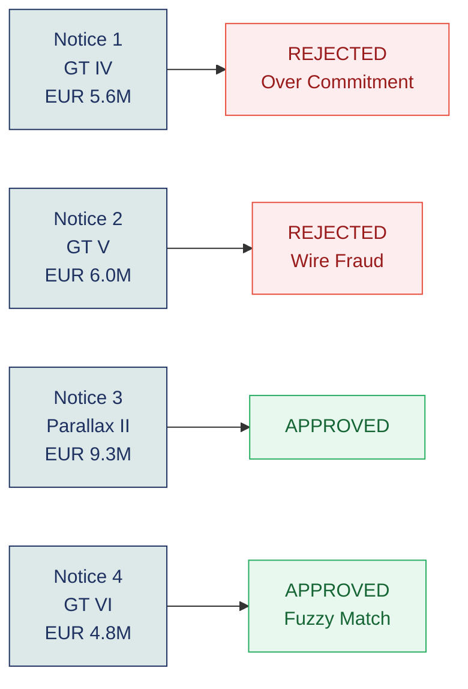
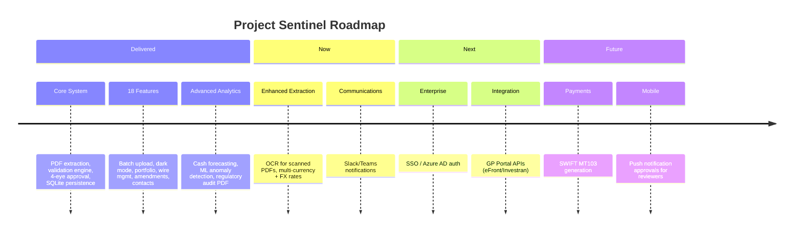

# Project Sentinel - Complete Project Overview

**Version:** 2.0 (Production-Ready) | **Date:** April 2026 | **Status:** Delivered

---

## What We Built

Project Sentinel automates Private Equity capital call processing -- from PDF ingestion through AI extraction, automated validation, 4-eye approval, to full audit trail.


---

## Architecture

```mermaid
flowchart TB
    accTitle: System Architecture
    accDescr: Four-layer architecture from Streamlit UI through extraction and validation to SQLite persistence.

    subgraph ui["Web Interface"]
        dashboard["Dashboard"]
        process["Process Capital Call"]
        audit["Audit Log"]
        wire["Wire Instructions"]
        contacts["GP Contacts"]
        portfolio["Portfolio Summary"]
    end

    subgraph extraction["Extraction Layer"]
        regex["Regex Parser<br/>EN/DE/FR/IT/ES"]
        llm["Claude API<br/>Fallback"]
    end

    subgraph validation["Validation + Anomaly Layer"]
        commit_check["Commitment Check"]
        wire_check["Wire Verification"]
        fuzzy["Fuzzy Fund Matching"]
        dupe["Duplicate Detection"]
        anomaly["ML Anomaly Detection<br/>Amount / Timing / Frequency"]
    end

    subgraph reporting["Reporting Layer"]
        forecast["Cash Forecasting<br/>12-month projection"]
        audit_pdf["Regulatory Audit PDF<br/>Calibrium-branded"]
    end

    subgraph persistence["Database Layer (SQLite WAL)"]
        ct["commitment_tracker"]
        exec["executed_calls"]
        processed["processed_calls"]
        wires_db["approved_wires"]
        users_db["users"]
    end

    ui --> extraction
    extraction --> validation
    validation --> persistence
    persistence --> reporting

    classDef layer fill:#1E3161,stroke:#1E3161,color:#fff
    classDef component fill:#DDE9E8,stroke:#1E3161,color:#1E3161
    classDef db fill:#132338,stroke:#1E3161,color:#E8EDF2
    classDef report fill:#F0F5F4,stroke:#1E3161,color:#1E3161

    class dashboard,process,audit,wire,contacts,portfolio component
    class regex,llm component
    class commit_check,wire_check,fuzzy,dupe,anomaly component
    class ct,exec,processed,wires_db,users_db db
    class forecast,audit_pdf report
```



---

## Validation Results

All 4 test notices produce the correct result:



| Notice | Fund | Amount | Commitment | Wire | Result | Detail |
|--------|------|--------|------------|------|--------|--------|
| 1 | GT Partners IV Equity | EUR 5.6M | FAIL | PASS | REJECTED | Exceeds EUR 3.9M remaining by EUR 1.7M |
| 2 | GT Partners V Equity | EUR 6.0M | PASS | FAIL | REJECTED | IBAN mismatch: DE (German) vs CH (Swiss) |
| 3 | Parallax Buyout II | EUR 9.3M | PASS | PASS | APPROVED | 60.8% utilization of EUR 15.3M remaining |
| 4 | GT Partners VI Equity | EUR 4.8M | PASS | PASS | APPROVED | Fuzzy match: "6" -> "VI" (100% confidence) |

---

## Materials Provided vs. Delivered

| Material | Provided | What We Built |
|----------|----------|---------------|
| `IO_Case_study_Capital_Calls.xlsx` | 4 sheets (Tracker, Upcoming, Executed, Wires) | Auto-seeded into SQLite with 10 tables |
| `Notice_1_GT_IV_Equity.pdf` | Over-commitment trap | Caught: blocks with amendment workflow |
| `Notice_2_GT_V_Equity.pdf` | Wire fraud trap | Caught: flags as fraud, shows GP contact |
| `Notice_3_Parallax_Buyout_II.pdf` | Valid notice | Processed: extracted, validated, approved |
| `Notice_4_GT_VI_Equity.pdf` | Fuzzy match trap ("6" vs "VI") | Caught: matched correctly at 100% |
| `Case Study Brief.docx` | 5 objectives + 4 success criteria | All met (see compliance table below) |

---

## Brief Compliance

| Success Criterion | Status | Evidence |
|-------------------|--------|----------|
| Handling unstructured data from different PDF formats | **Met** | Regex + LLM dual-mode, 5 languages, 4 diverse test PDFs (German, French, multi-page, reordered) |
| Implementation of risk controls | **Met** | Commitment check, wire verification, duplicate detection, zero-amount guard, wire change audit, ML anomaly detection |
| Functional web UI with human-in-the-loop (4-eye check) | **Met** | Role-based users, reviewer != submitter, two-step confirmation, batch approval |
| Clean, documented code | **Met** | README, CLAUDE.md, 50 tests passing, modular architecture, design document |

---

## Security Controls

```mermaid
mindmap
    accTitle: Security Controls Map
    accDescr: Eight security controls organized by type: automated checks, process controls, and technical safeguards.

    root((Security))
        Automated Checks
            Commitment Check
            Wire Verification
            Duplicate Detection
            Zero-Amount Guard
            ML Anomaly Detection
        Process Controls
            4-Eye Principle
            Wire Change Audit
        Technical Safeguards
            XSS Prevention
            SMTP Isolation
```

---

## Roadmap



---

## Known Issues & Limitations

| Issue | Severity | Mitigation |
|-------|----------|------------|
| No real authentication (dropdown user selector) | Medium | SSO integration planned for "Next" phase |
| `app.py` is 1,900 lines (monolithic) | Low | Functions are logically sectioned; page module split deferred |
| No OCR support for scanned/image PDFs | Medium | Claude API handles some; pytesseract planned for "Now" phase |
| Session state lost on server restart | Low | All critical state is in SQLite; only in-flight uploads are lost |
| Single-server deployment only | Low | Adequate for 5-10 user treasury team; PostgreSQL migration path exists |
| Euro-only display formatting | Low | Multi-currency FX planned for "Now" phase |

---

## Deliverables Summary

| Deliverable | File | Description |
|-------------|------|-------------|
| Web Application | `app.py` + modules | Full Streamlit dashboard at localhost:8501 |
| Anomaly Detection | `anomaly_detector.py` | Statistical scoring (amount/timing/frequency z-scores) |
| Audit PDF Generator | `audit_report.py` | Calibrium-branded regulatory report (ReportLab) |
| Database | `sentinel.db` | Auto-created SQLite with 10 tables |
| Test Suite | `tests/` | 50 pytest tests (extraction, validation, database) |
| Test PDFs | `test_notices/` | 4 diverse format PDFs (DE, FR, multi-page, reordered) |
| Presentation | `Project_Sentinel_Presentation.pptx` | 10-slide Calibrium-branded deck |
| Speaker Notes | `docs/PRESENTATION_SCRIPT.md` | Full script + demo flow + Q&A cheat sheet |
| Handout | `Project_Sentinel_Handout.pdf` | 13-page PDF with all project details |
| Design Document | `docs/plans/2026-04-13-project-sentinel-design.md` | Architecture + roadmap |
| Implementation Briefs | `docs/implementation-briefs/` | 18 feature briefs for parallel development |
| README | `README.md` | Setup, features, architecture, test results |
| CLAUDE.md | `CLAUDE.md` | AI development conventions |
| Source Code | `github.com/SEFICO-23/Sentinel` | Full repository |
